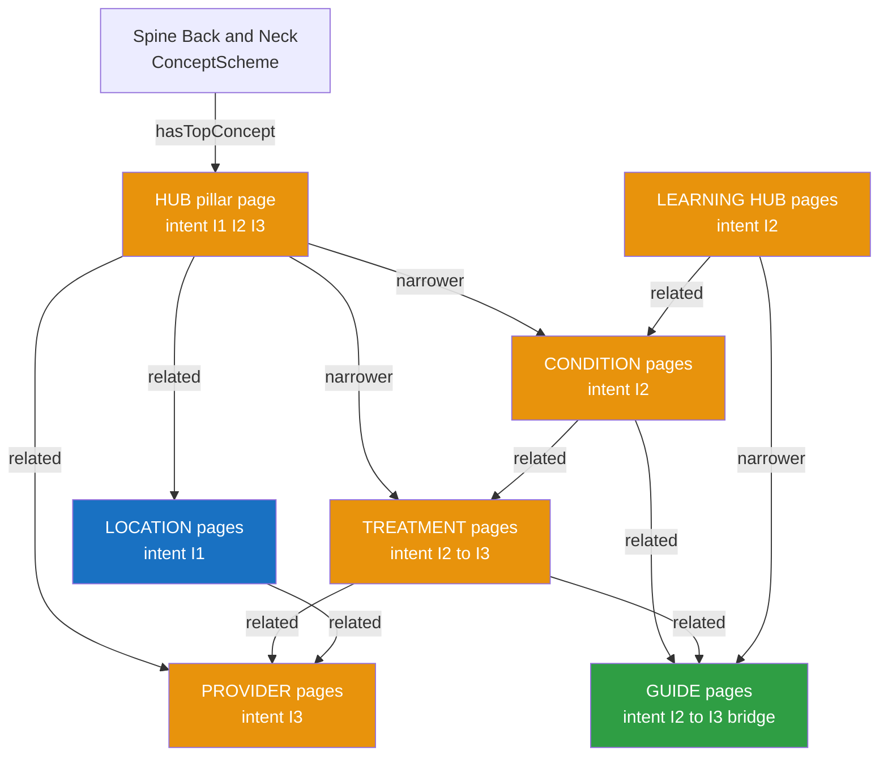
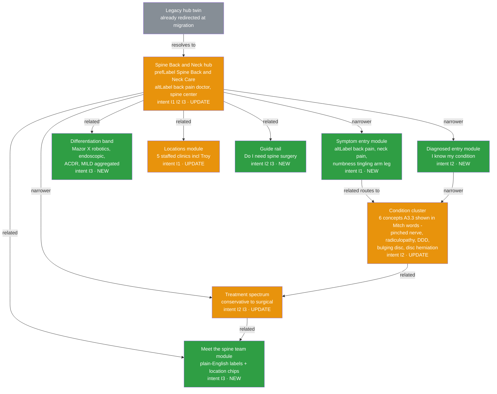
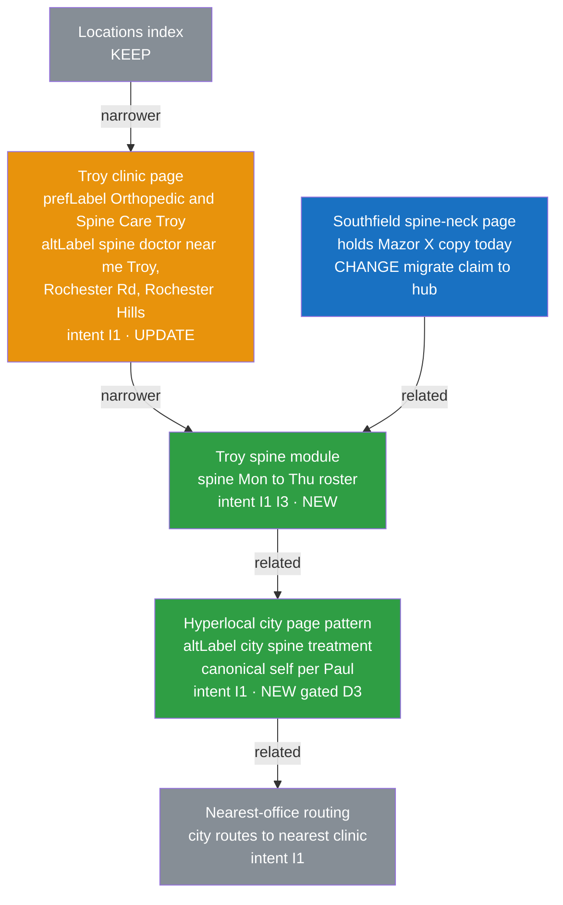
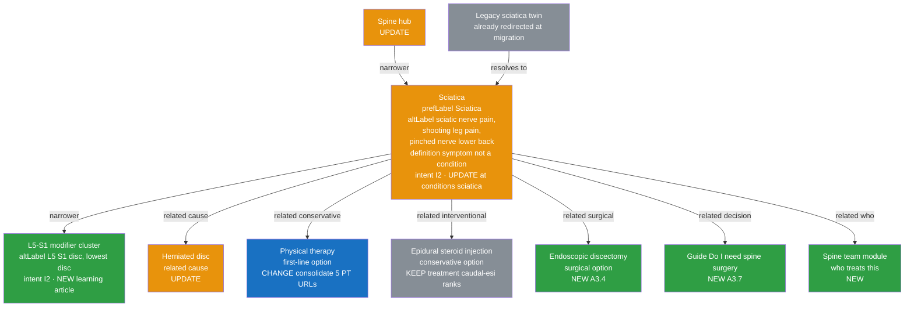
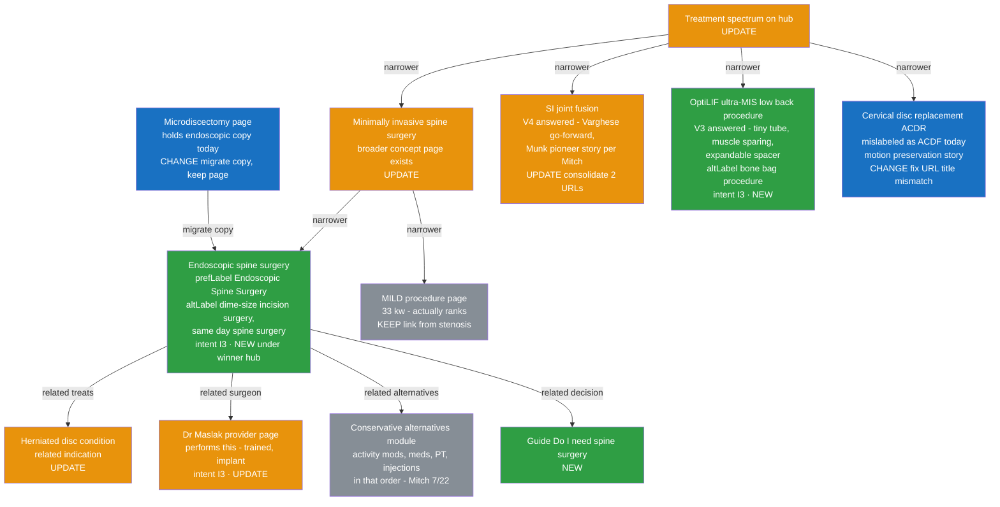
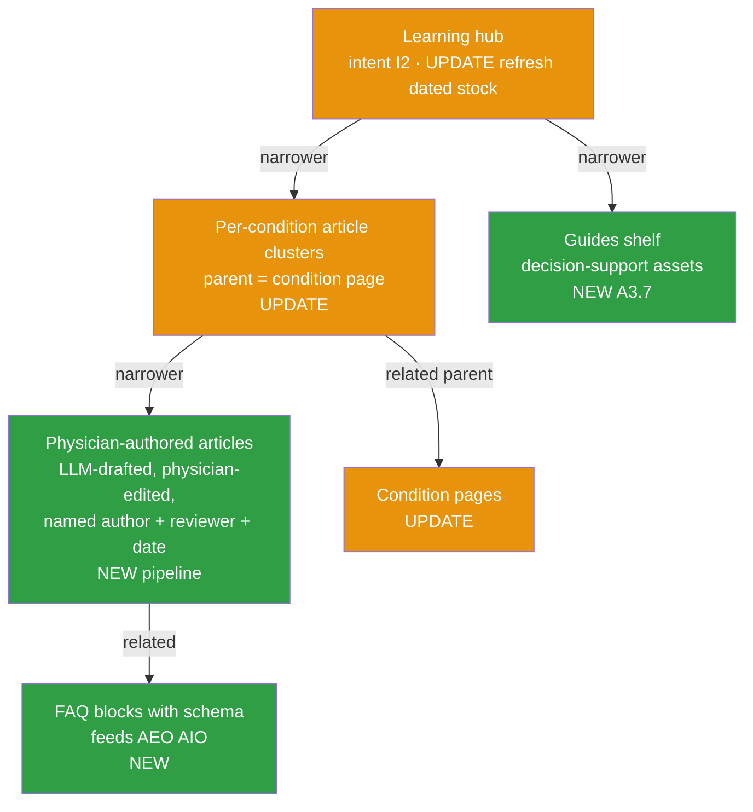
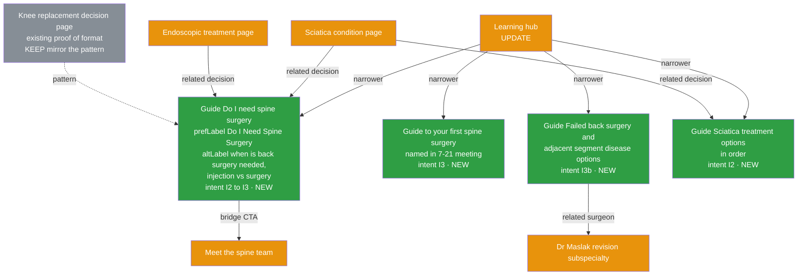
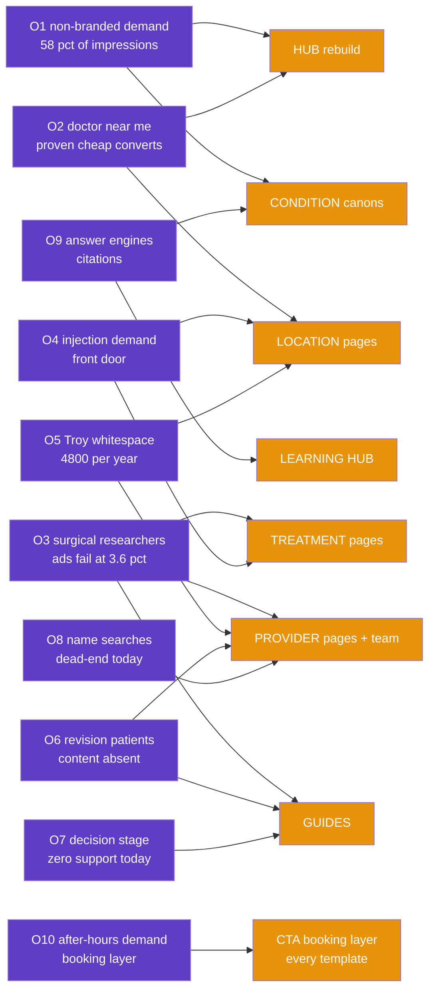

# Spine Semantic Model (SKOS) — Page Types, Diagrams, and the Change Plan

**Owner:** Joe · **Clinical labels:** Mitch sign-off · **Data gates:** per
`routing-clinical-intelligence-process.md` §3–4 · **Templates:** `spine-page-templates.md`
**Status: DRAFT — pending clinical (Mitch) + compliance review**

## How to read this document

| Part | What it is | Volatility |
|---|---|---|
| **A — The Model** | The stable reference: SKOS mapping, the master scheme, the seven page types with their diagrams | Changes rarely; label changes need Mitch |
| **B — Current State** | Where spine actually lives today, the canonical targets, open decisions, and **the opportunity map (B3) — what each concept exists to capture** | Dated 7/21/2026; updates as V-items resolve |
| **C — The Change Plan** | Per-page-type change lists + the initiative table (the work) | Updates as work ships |
| **D — Routing Intelligence** | How the altLabel layer drives site, call center, triage tree, PL materials | Stable rules |
| **E — Governance & Changelog** | Change rules, Phase-2 sports note, correction log | Append-only |

**Diagram legend (all diagrams):** green = NEW (create) · amber = UPDATE (rework) · blue =
CHANGE (leftover/straggler tidy-up — legacy twins were already redirected at migration; V6 verifies coverage; any live straggler gets a canonical tag, never a new redirect) · gray = KEEP (protect / already resolved).
**Intents:** `I1` solve my problem · `I2` learn what's causing it · `I3` choose my surgeon ·
`I3b` returning/revision patient.

---

## For Mitch — the model in plain clinical language (2 minutes)

Think of the website as a clinic with rooms, and this document as its floor plan.

- **Every page is like a diagnosis or service in your taxonomy.** It has a proper clinical
  name (what we call the *prefLabel* — you validate these) and the words patients actually
  use for it (*altLabels* — "shooting leg pain" for sciatica, "pinched nerve" for
  radiculopathy). Same relationship as a chief complaint to an ICD code. **The patient words
  are the routing layer** — the same vocabulary your Friday triage list gives the call center.
- **Pages link to each other the way you'd refer a patient.** A sciatica page "refers" to
  PT first, injections second, surgery when indicated — conservative-first, exactly your
  practice pattern. Those links are drawn as arrows in the diagrams; an arrow is a referral
  pathway between pages.
- **The seven page types are seven jobs:** the hub is the front desk; condition pages explain
  what's wrong; treatment pages explain what we do about it (with honest candidacy and
  alternatives — your CCM Plus criteria eventually feed these); provider pages help a patient
  pick the right surgeon (your matching matrix); location pages say who's where on which day
  (the 7/13 schedule); guides walk a decision ("do I need surgery?"); the learning hub is
  patient education with a named physician reviewer.
- **The color codes are triage categories for pages:** green = build new · amber = fix what
  exists · blue = tidy-up of leftover pages (mostly already handled at migration) · gray = working or already resolved, don't touch.
- **The patient-journey shorthand:** I1 = "I'm in pain, get me in" · I2 = "what's wrong with
  me?" · I3 = "who should do my surgery?" · I3b = "I had spine surgery and it's back" (your
  revision patients — adjacent segment disease, failed back surgery).

**What we need from you (and only this):** confirm the clinical names and patient-word
mappings are right; approve one red-flag warning we'll reuse everywhere; name one physician
reviewer per page ("medically reviewed by Dr. X" — the credibility engine); and sanity-check
that the referral pathways between pages match how you actually want patients routed.
**You can skip Parts B and C entirely** — that's URL plumbing and work tracking. Your parts:
this page, the A3 diagrams (do the arrows match clinical reality?), and Part D (routing).

**The best way to review:** open `pm/mitch-review-packet.md` — it walks you through seven
live pages on the site (one per page type), what each will become, and the 14 questions only
you can answer. ~25 minutes, clickable, margin notes welcome.

---

# PART A — THE MODEL

## A1. How SKOS maps to pages

| SKOS element | Meaning here | Example |
|---|---|---|
| `ConceptScheme` | The Spine Care domain on synergyhealth.org | Spine, Back & Neck |
| `Concept` | One page (or a module on a page) | Sciatica condition page |
| `prefLabel` | The clinical term (Mitch-validated) — usually the H1 | "Sciatica" |
| `altLabel` | **Patient language** — drives SEO targeting, internal-link anchors, call-center vocabulary, and the triage tree (the routing layer; see Part D) | "shooting leg pain," "sciatic nerve pain," "pinched nerve in lower back" |
| `broader` / `narrower` | Hierarchy (hub → condition → modifier cluster) | Sciatica → L5-S1 cluster |
| `related` | Cross-facet links (condition ↔ treatment ↔ surgeon ↔ location ↔ guide) — rendered as on-page internal-link modules | Sciatica ↔ Epidural injection ↔ Endoscopic discectomy |
| `definition` | The page's job in one sentence | "Explain sciatica and route to the right next step" |

**Custom annotations on every node:** `intent` (I1/I2/I3/I3b) · `status` (NEW / UPDATE /
CHANGE / KEEP) · `inputs` (who feeds it: Mitch, Joel Carr data, physician interview,
Katie/Kelly language…).

**The founding constraint (Joe, 7/21):** condition × treatment × surgeon × location is
**many-to-many** — model it, don't improvise it — and spine grows via internal linking + the
learning hub **without restructuring ortho** ("orthopedics is the phylum; spine is a
subspecialty of it").

## A2. Master scheme — the seven page types

As a patient journey: **I1** lands on hub/location symptom entries → **I2** deepens on
condition + learning pages → **guides** bridge the decision → **I3** chooses on treatment +
provider pages. Every `related` edge becomes a visible internal-link module
(`spine-page-templates.md`).

## A3. The seven page types (job · intents · diagram)

> Change lists for each type live in §C1, in the same order. Example URLs reflect the §B2
> canonical targets.

### A3.1 HUB — "Spine, Back & Neck Care"
**Job:** front door for all intents; orients by **symptom or diagnosis** (the site today serves
only the already-diagnosed); routes everything; carries the aggregated differentiation story.
**URL:** the §B2 V6 winner. **Status: UPDATE (rebuild in place).**

### A3.2 LOCATION — spine × geography
**Job:** capture "near me" and city demand (I1); each clinic owns its county — market
location-by-location. **Sequencing: main hubs (Sterling Heights, Livonia) first, then Troy**
(`spine-location-intent-roadmap.md`). **Troy altLabels include "Rochester Rd," "Rochester
Hills," "Rochester MI"** — there is no Rochester clinic; the Troy clinic is on Rochester Road
(corrected 7/21). GBP/listings = separate track (see §E1).

### A3.3 CONDITION — example: Sciatica
**Job:** the I2 workhorse — explain the condition in patient language, then route to the right
next step. Six condition concepts: **spinal stenosis · herniated disc · sciatica ·
degenerative disc disease · spondylolisthesis · radiculopathy/pinched nerve.**
**Hub-surface vocabulary (Mitch, 7/22):** the first conditions surface patients see carries
his five words **verbatim** — pinched nerve · radiculopathy · degenerative disc disease ·
bulging disc · disc herniation (bulging disc/disc herniation → the herniated-disc canon;
pinched nerve/radiculopathy → the radiculopathy canon). Patients do use "radiculopathy" and
"DDD" — clinical terms are patient vocabulary here, not jargon to hide.
**Reviewer roster (A5, Mitch 7/22):** counts assigned — **McCarty ×2 · Maslak ×2 · Varghese ·
Salar**; proposed mapping in `pm/mitch-review-answers-2026-07-22.md` (confirm Wed).

### A3.4 TREATMENT — example: Endoscopic Spine Surgery
**Job:** the I2→I3 bridge — honest candidacy, alternatives, recovery; then differentiate the
surgeon. Differentiation set (7/21, resolved 7/22): **Maslak = endoscopic · Varghese = SI
fusion (V4 ✅ go-forward; Munk = the trained-alongside-pioneers story, wording in
substantiation review) · McCarty = OptiLIF (V3 ✅ — the real name of "T-Lift/bone bag": an
ultra-minimally invasive low back procedure — tiny tube, spares major back muscles,
expandable spacer).** Kyphoplasty explicitly NOT featured (undifferentiated).

### A3.5 PROVIDER — example: Dr. Maslak
**Job:** the I3 decision surface — assemble a *choosing* journey the bios don't offer today.
**Labeling doctrine (Mitch, 7/22): INCLUSIVE, not pigeonholed** — "all our spine docs do all
the stuff"; every surgeon presents **full-spectrum spine care plus one ~10% nuance line:
Varghese = SI fusion · McCarty = OptiLIF · Salar = minimally invasive · Maslak = robotic ·
Lee = non-surgical options** (the pain-management front door). This supersedes the earlier
subspecialty-first labels (Maslak "revision," Salar "motion preservation," Munk "SI").
**McCarty is Medical Director of Spine (V5 ✅)** — stated on his bio + one team-module line,
deliberately light so it never funnels all traffic to him. **Munk:** full-spectrum bio; his
SI/iFuse history is told on the SI-fusion page as the pioneer/lineage story, not as his bio
label. **Zamorano:** basic generic page, leaning into neurosurgery + balance training.
Revision/I3b stays a **content lane** (guide + revision content), not a bio label.
**Corrections (Joe 7/22): SHP offers NO scoliosis/deformity service — bios and site
metadata that imply it (Maslak, Varghese) are overstated and get corrected, and training
history is never presented as a service. Dr. Kevin Lee is PAIN MANAGEMENT, not a spine
surgeon — he is labeled with the interventional front door (Oddo, Lee, Kassa, Singh), never
in the surgeon set.**

### A3.6 LEARNING HUB — the education layer
**Job:** answer the I2 long tail; feed AEO/AIO/GEO citations; host the guides. Doctrine:
commodity articles are worthless ("everyone can spin up an article") — value = **physician-
authored relevance** + answering questions patients actually ask.

### A3.7 GUIDE — the decision-support bridge
**Where guides live (the canonical answer):** one clean home at **`/guides/{topic}/`** —
narrower concepts of the learning hub in the hierarchy, but reached mostly through `related`
links from every condition, treatment, and hub page they serve. **They are the I2→I3 bridge.**
One URL per guide, no duplicates; the existing knee decision page proves the format ranks.
**When to build a guide:** the patient's question is a **decision or journey** ("do I
need…", "which…", "X vs. Y", "in what order"), not a definition.
**What a guide contains:** honest short answer up front · who-it's-for + red-flag interrupt ·
stepped pathway (conservative → interventional → surgical, Mitch-approved) · symptom→pathway
map · clinically reviewed candidacy checklist · what-to-expect timeline · insurance clarity
(D7) · named author/reviewer/date · FAQ block · dual CTA (soft I2 + I3 bridge). Full layout:
templates §3.7.

**The first six guides (all NEW):** Do I need spine surgery? (I2→I3) · Guide to your first
spine surgery (I3; Anna's post-9/1 flow) · Failed back surgery & adjacent segment disease
(**I3b**; Maslak) · Sciatica treatment options in order (I2) · Injection vs. surgery (I2→I3;
Oddo/Lee) · Which spine surgeon do I need? (I3; **gated on the Mitch matrix**).

---

# PART B — CURRENT STATE (as of 7/21/2026 — updates as V-items resolve)

## B1. Where spine lives today

**Corrected 7/22 (per Joe): the legacy duplicate URLs were already redirected at the Apr 22
migration.** What the July index crawl saw — six parallel spine structures, hub ×2, stenosis
×3 — are largely **stale index entries decaying, not live competing pages** (consistent with
GA4: converting sessions land on `/specialty/…` 1,445:1). The live problems are therefore
content problems, not URL problems: the five condition pages rank for ≤1 keyword each
(sciatica: zero), and the real differentiators — **Mazor X first-in-MI robotics, endoscopic
discectomy, ACDR motion preservation, MILD, 3-T MRI** — sit stranded on location pages, bios,
and legacy slugs while the Salar bio alone carries ~21% of site traffic. Full inventory:
the 7/21 site-map synthesis + `pm/spine-page-inventory-improvement-register.md`.

## B2. Canonical targets + the open hub decision

> **HUB RESOLVED (7/22, per Joe + GA4): `/specialty/spine-neck-back` is the live hub** — the
> legacy `/specialties/…` structure was redirected at migration; its index entries are
> decaying on their own. **V6 shrinks to a coverage check:** Paul verifies every legacy pair
> actually resolves to its canon and flags any straggler still serving its own page (e.g.,
> `lumbar-stenosis` vs. `spinal-stenosis` within the new structure, parameter URLs). A
> straggler gets a canonical tag — never a new redirect (rule below).

> **🚫 NO-REDIRECTS DIRECTIVE (Joe, 7/21) — standing rule for all consolidation.**
> This program never creates redirects. Consolidation mechanics, in order:
> **(1) rel=canonical** from twin → canon (both pages stay live; Google consolidates signals);
> **(2) internal-link discipline** — nav and body links point ONLY at canons, twins get zero
> internal links; **(3) content differentiation** where both URLs deserve to live (rewrite the
> twin to a different intent); **(4) noindex** for parameter junk (`?y_source=`, `scct`)
> — never a 301, and never delete-to-404 (legacy pages get rebranded in place).
> Trade-off, stated honestly: canonical is a hint, not a command — consolidation is slower and
> less absolute than redirects; the mitigation is (2), starving twins of internal links so
> signals concentrate. Paul implements; Cardinal is informed and must not 301 our URLs from
> their technical queue.

| Facet | Canonical home | Legacy twins (already redirected at migration — V6 verifies coverage; stragglers get a canonical tag, never a new redirect) |
|---|---|---|
| Hub | `/specialty/spine-neck-back/` (confirmed live — GA4 + Joe 7/22) | `/specialties/spine-back-and-neck/` + parameter/slash variants (index entries decaying) |
| Conditions | `/conditions/{condition}` (the proven ranker) | all `/conditions-we-treat/spine-neck-back-conditions/*` twins · `/conditions/lumbar-stenosis/` → `spinal-stenosis` · root orphans (herniated-disc-microdiscectomy, degenerative-disc-disease-treatment) — **migrate good copy first** |
| Surgical procedures | under the winning hub's children | `/treatment/` surgical twins |
| Injections / interventional | `/treatment/{injection}` (caudal-esi ranks) | `/specialties/pain-management/` twins |
| Providers | `/providers/{name}` | typo/duplicate profiles · `/our-providers/` |
| Guides | `/guides/{topic}/` (new namespace) | — |

**Evidence caveats:** crawl = index-based (canonical tags and URL resolution unverified); GA4 export =
converting-sessions-only with broken channel attribution; Ads data = **era-resolved 7/21**
(daily re-export; post-migration figures used below). Directional until §E gates clear them.

## B3. The opportunity map — what each concept exists to capture

Every node in Part A earns its place by capturing one of these ten quantified opportunities.
When priorities are argued, argue from this table. (Sources: paid analysis §8, GA4 read,
crawl synthesis, `spine-90day-plan.md` lever math. NP value frame: website work = lever B,
**+7–11 qualified spine NPs/week**, of the 47→72/week climb.)

| # | Opportunity (evidence & size) | Intent | Captured by (model concepts) | Initiative |
|---|---|---|---|---|
| **O1** | **Non-branded organic spine demand** — 58% of impressions are non-branded researchers; the elective funnel contributes ~0 organic; five condition hubs strangled by duplication | I2 | Condition canons + hub rebuild + consolidation | 1, 5 |
| **O2** | **"Doctor near me" demand, paid-proven** — $158–228 CPA at 11–14% CR in paid; organic equivalent is free; winners at 74–95% impression share (maxed) | I1 | Location pages + hub symptom router + near-you modules | 6 + location roadmap |
| **O3** | **Surgical researchers ads can't convert** — $60.7K post-migration on surgery keywords at 3.6% CR ($688 CPA); these are I3 patients needing content, not ads | I3 | Treatment differentiation pages + comparison content + team module + matching guide | 2, 3, 4, 8 |
| **O4** | **Interventional/injection demand** — $410–859 CPA in paid while `/treatment/caudal-esi` ranks and converts free; Livonia is the procedure hub | I1/I2 | Injection canons + Livonia EMG/injection block + conservative-front-door `related` edges | 5, 6 |
| **O5** | **Troy / Oakland whitespace** — ~4,800 obtainable patients/yr; zero campaign; near-zero organic; existing geo winners have no IS headroom left; supply now Mon–Thu | I1/I3 | Troy location concept + Zamorano page + Rochester-altLabel layer + hyperlocal satellites | Location roadmap §3.3, 9 |
| **O6** | **Revision/returning patients** — content absent sitewide; smaller, high-value cohort; Maslak's actual subspecialty | **I3b** | Revision guide + Maslak positioning + adjacent-segment content | 7, 8 |
| **O7** | **Decision-stage patients** — zero decision-support in spine; the knee guide proves the format ranks | I2→I3 | The six guides (A3.7) | 7 |
| **O8** | **Name-search capture, won but under-used** — Salar bio = #1 page (2,900/mo name volume) yet a dead end | I3 | Provider KEEP/protect + "procedures I perform" modules routing name traffic onward | 8 |
| **O9** | **Answer-engine citations** — MRI-facts post quietly converts; first AI-assistant referrals appeared in GA4; E-E-A-T absent sitewide | I2 | Learning hub + FAQ content + E-E-A-T apparatus | 5, 10 |
| **O10** | **Demand that arrives when nobody answers** — $40.4K weekend paid at $480–505 CPA; 166 patients self-rescheduled online | I1 | Not a page — the **CTA/booking layer** on every template (online-first) + the measurement fixes | Templates §2 + process §3 |

**Reading the map:** every page type carries at least one funded opportunity — and every
opportunity has a home. If a proposed page can't point at an O-number, it doesn't get built
(the same discipline as the D3 hyperlocal gate). Per-URL execution: `pm/spine-meta-execution-list.md`.

---

# PART C — THE CHANGE PLAN

## C1. Change lists by page type (same order as A3)

**HUB:** rebuild on the winner URL per templates §3.1 (dual entry, symptom router,
differentiation band with V2-cleared claims, team module pending V5, guide rail) · legacy hub
twin already redirected at migration (V6 verifies coverage) · fold the misfiled Munk
doctor-location child's content into his bio + the PH location page.
**LOCATION:** main hubs first (SH, Livonia roster modules + LP variants) → Troy rebuild +
Troy spine module → Southfield honest-supply rebuild → PH visiting-cadence module ·
hyperlocal pages ONLY post-D3, canonical self-referential, no thin doorways · Mazor X claim
migrates Southfield→hub · GBP = separate track (§E1).
**CONDITION:** the `/conditions/` canon stands (legacy twins already redirected — V6 verifies; §B2) · keep the
Grade 6–9 copy, add E-E-A-T blocks (**A5 ✅ 7/22 — McCarty ×2, Maslak ×2, Varghese, Salar;
mapping confirm Wed**), symptom-language openings, standardized red-flag block (**A6 ✅ 7/22 —
stenosis wording is the standard**), treatment-spectrum + guide rails (ladder order: activity
mods → meds → PT → injections, Mitch 7/22) · **NEW pinched-nerve patient-language entry** ·
protect neck-fracture (KEEP) while absorbing its twin.
**TREATMENT:** three differentiation pages via physician interviews (endoscopic NEW ·
SI fusion — **V4 ✅ Varghese; superlative wording in substantiation review** · OptiLIF —
**V3 ✅ named 7/22**; trademark check before publish) · fix the ACDR mislabel +
fusion-vs-ACDR comparison · candidacy blocks (CCM Plus, ~mid-Sept) ·
conservative-alternatives module everywhere (activity mods → meds → PT → injections) · gated
outcomes slots (CODE only) · consolidate twins per §B2.
**PROVIDER:** team module + matching guide (**V5 ✅ — McCarty Medical Director, stated
light**; Mitch matrix + Katie routing-ops OK still gate matching) · **inclusive labels per
Mitch 7/22: full-spectrum + one ~10% nuance line** (Varghese SI · McCarty OptiLIF · Salar
minimally invasive · Maslak robotic · Lee non-surgical) · "procedures I perform" modules ·
fellowship translation (Varghese first) · clinic-days lines (schedule work order) · dedupe
profiles, retire `/our-providers/` · V2 sweep of bio stats · Salar = KEEP/protect ·
Zamorano = basic generic page (neuro + balance training).
**LEARNING HUB:** refresh/retire dated stock (legacy Mendelson posts → rebrand-in-place, never delete or redirect) ·
physician-author pipeline (named byline) · articles cluster under parent conditions ·
question-formatted for answer engines.
**GUIDE:** build the six (A3.7 list) on templates §3.7; each clinically reviewed; the
which-surgeon guide waits on the B2 matrix.

## C2. Initiative → change plan (the work, per initiative)

| Initiative | Concepts touched | Status | Inputs | Agent work | Gate |
|---|---|---|---|---|---|
| **1. Hub rebuild + consolidation** | Hub; twin; Munk child | UPDATE + CHANGE | Paul V6; Mitch review; Cardinal coordination | seo-specialist canonical map; content-creator hub copy | V6 → Mitch → compliance |
| **2. Endoscopic (Maslak)** | Endoscopic page; microdiscectomy copy; Maslak bio; herniated-disc links | NEW + CHANGE + UPDATE | Maslak hour; Mitch | content-creator; aeo FAQ | Mitch → compliance |
| **3. SI fusion (Varghese)** | SI consolidation ×2→1; Varghese bio | UPDATE + CHANGE | **V4 ✅ 7/22** (Varghese; Munk pioneer story); Varghese interview; superlative wording → substantiation | content-creator; seo-specialist | Mitch wording → compliance |
| **4. OptiLIF (McCarty)** | OptiLIF page (was "T-Lift") | NEW | **V3 ✅ 7/22** (Mitch description); McCarty hour; trademark check | content-creator | Mitch → compliance |
| **5. Condition rescue (6)** | 6 canons; twins; pinched-nerve entry | UPDATE + CHANGE + NEW | V1 priority data; **A5 ✅ 7/22** (counts; mapping confirm Wed) | content-creator; seo-specialist | V6 → V1 → Mitch |
| **6. Symptom-entry layer** | Hub router; condition openings; red-flag blocks | NEW | Friday triage list; Steve's tree branches | content-creator + call-center-manager | Mitch (clinical safety) |
| **7. Decision/guide layer** | 6 guides | NEW | Mitch; physicians per guide; Anna | content-creator; aeo-specialist | Mitch → compliance |
| **8. Team + surgeon matching** | Team module; matching guide; bio modules; dedupe | NEW + UPDATE + CHANGE | **V5 ✅ 7/22** (McCarty MD-of-spine, light); inclusive labels per Mitch; matching matrix still pending | content-creator; seo-specialist | Mitch matrix → Katie |
| **9. Hyperlocal expansion** | City pages | NEW (gated) | **D3**; Paul canonical rule | seo-specialist + content-creator | D3 threshold |
| **10. Learning-hub refresh** | Dated stock; author pipeline; FAQ content | UPDATE + NEW | Physician authors (Mayo offered, ortho) | content-creator; aio/geo formatting | Clinical review per piece |
| **11. Rebrand/staleness purge** | Legacy posts; Kornblum testimonial; stale Munk copy | CHANGE | Paul execution | seo-specialist in-place rebrand edit list | Joe |

**Execution layers:** per-URL work specs = `pm/spine-meta-execution-list.md` · schedule-driven
updates = `pm/website-schedule-update-workorder.md` · sequencing =
`playbooks/spine-website-game-plan.md` + `spine-location-intent-roadmap.md`.

---

# PART D — ROUTING INTELLIGENCE

## D1. The altLabel layer

One shared **consumer-language ↔ clinical-term ↔ destination map** (validated by Mitch,
seeded from the Friday triage list — "as simple as radiculopathy… there's two or three")
drives four surfaces:
1. **Site internal routing:** symptom modules → condition pages → treatment spectrum →
   differentiated surgeon; the **conservative-first front door** (PT / interventional pain:
   Oddo, Lee, Kassa, Singh) mirrored in `related` edges so I1 patients enter the right door
   and stay in-system until surgical candidacy.
2. **Call center:** Kelly's scripts — same words, same destinations
   (`pm/spine-intake-qualification-script.md`).
3. **Steve's triage tree** (Santosh + Joe rollout): branches must agree with the site's
   symptom logic; three-steps-max; traditional-Medicare gap fixed before rollout.
4. **PL leave-behinds** (Kristen): referrer-facing versions of the same differentiation.

**Red-flag rule:** every symptom surface carries the standardized, clinically approved
escalation block (bladder/bowel changes, fever with back pain, trauma → urgent/911 routing).
**Approved 7/22 (A6):** the stenosis page's bladder/bowel wording is the sitewide standard.

**Validated vocabulary (Mitch, 7/22):** patients DO use **radiculopathy** and **degenerative
disc disease** — treat clinical terms as patient-facing vocabulary where Mitch says so, not
jargon to hide. The hub's first conditions surface carries his five words verbatim:
pinched nerve · radiculopathy · degenerative disc disease · bulging disc · disc herniation.
(First tranche of A7 validation; full map review still pending.)

## D2. The internal-link contract — what each page must link, and what must link to it

The diagrams' arrows are build requirements, not illustration. Every `related`/`narrower`
edge in Part A becomes a real link in a named module (`spine-page-templates.md` placements).
This is the per-page-type contract.

**Golden rules (all pages):**
1. **Every arrow is two-way.** If sciatica links the endoscopic page, the endoscopic page
   links sciatica back (its indications). A one-way `related` edge is a build bug.
2. **Anchors are altLabels, in sentence context** — the destination's patient words, never
   "click here"/"learn more" alone: *"an* epidural steroid injection *often calms the nerve"*
   → `/treatment/caudal-esi/`. This is how the routing vocabulary becomes crawlable.
3. **Links point ONLY at canons** — never at a legacy twin, parameter URL, or straggler.
4. **No orphans:** a NEW page ships with **≥3 inbound links** already live (its hub grid slot,
   its condition/treatment partners, its guide rail). Publishing an unlinked page is a defect.
5. **Curated, bounded counts** — these modules replace the 300-link mega-nav disease, not
   reproduce it. Body-link budget per page: hub ~25 · condition ~12–15 · treatment ~10–12 ·
   provider ~8–10 · location ~10–12 · guide ~10 · article ~5–7.
6. **Conservative-first ordering inside treatment content:** the copy ladder is **activity
   modifications → medications → PT → injections → surgery** (order per Mitch, 7/22 — he
   reversed our injection-adjacent drafts); the linked steps (PT page → injection page →
   surgery page) appear in that same order. The link order itself is clinical messaging.

**Per-page-type contract** (OUT = links this page must carry · IN = pages that must link here):

| Page | OUT (module → destinations) | IN (must be linked from) |
|---|---|---|
| **HUB** | Condition grid → all 6 canons · pathway band → PT, `/treatment/caudal-esi/` (exemplar injection), endoscopic page (exemplar surgery) · differentiation band → each differentiator's treatment page · team module → 5 surgeon bios + pain-management page · locations band → 5 clinic pages · guide rail → 2 guides · symptom router → conditions + orthopedic urgent care | Every spine page's breadcrumb ("Spine care") · homepage dual-entry strip · location pages' services line |
| **CONDITION** (ex. sciatica) | Breadcrumb → hub · "what's causing it" → related condition(s) (herniated disc) · **"treatment options, in order"** → PT canon → relevant injection(s) → relevant surgery page(s), each with its honest indication sentence · "who treats this" → 1 pain bio + 1–2 surgeon bios (per Mitch's matrix) · guide rail → its decision guide · near-you chips → 5 locations · cluster rail → its learning-hub articles | Hub condition grid · sibling conditions where clinically related · every treatment page that treats it (indications) · its guide · its cluster articles (parent link) · hub symptom router |
| **TREATMENT** (ex. endoscopic) | Breadcrumb → hub (via treatment spectrum) · **"conditions this treats"** → 2–3 condition canons · **conservative-alternatives module** → PT + the injection tried first · surgeon module → the performing surgeon's bio · comparison rail → sibling treatments (microdiscectomy · fusion · ACDR) · guide rail → "Do I need spine surgery?" | Condition pages' treatment-in-order sections · the surgeon's "procedures I perform" · hub differentiation/pathway bands · relevant guides · (MILD ← stenosis page specifically) |
| **PROVIDER** (ex. Maslak) | **"Procedures I perform"** → his treatment pages · "conditions I treat" chips → 2–4 canons · location chips → his clinic pages · "meet the full team" → hub team module | Hub team module · every treatment page he performs · location rosters where he sits · the matching guide · relevant guide bylines ("reviewed by") |
| **LOCATION** (ex. Troy) | Roster names → each provider bio · services line → hub (+ EMG/injection logistics page for Livonia) · cross-route → nearest alternative clinic (Southfield→Livonia rule) · near-you siblings → 2 adjacent clinics | Hub locations band · condition near-you chips (all 6 × 5) · provider location chips · hyperlocal satellites (post-D3) → their nearest clinic |
| **GUIDE** (ex. do-i-need-spine-surgery) | The conditions it serves (2–3 canons) · the treatments it weighs (injection + surgery pages) · team module (I3 bridge CTA) · booking | **Every condition + treatment page it serves (guide rail)** · hub guide rail · learning-hub shelf · sibling guides |
| **ARTICLE** | Parent condition (cluster link — exactly one parent) · the relevant guide · 1–2 treatments mentioned | Parent condition's cluster rail · sibling articles |

**Worked example — the sciatica canon's 13 links:** hub (breadcrumb) · herniated-disc (cause)
· PT canon, `/treatment/caudal-esi/`, endoscopic page (treatment order) · 1 pain bio + 1
surgeon bio (who treats) · sciatica guide (rail) · 5 location chips (near-you). In return,
sciatica must be linked from: the hub grid + symptom router, herniated-disc's related block,
caudal-ESI's and endoscopic's indications, the sciatica guide, and its future cluster articles
— **11+ inbound**. That mesh, repeated across the model, is what replaces the missing topical
authority (31.8 vs. 70 benchmark) without touching ortho's architecture.

**Build & QA:** the seo-specialist agent generates the per-URL link checklist from this
contract (the meta execution list's per-page "content updates" reference it); Paul builds the
modules; QA = walk each page's OUT list and each destination's IN list before publish — a
missing arrow is a launch blocker, same class as a missing E-E-A-T block.

---

# PART E — GOVERNANCE & CHANGELOG

## E1. Change rules
- **This file is the model of record.** Clinical labels (prefLabel, candidacy, matching) →
  **Mitch**. New concepts → Joe + the process §4 data gates. Status/URL changes →
  seo-specialist plan → **V6 live check** → Paul/Cardinal execute.
- Statuses update as work ships (NEW → KEEP; CHANGE → retired); reviewed at the 4-week OODA.
- **GBP separation rule (Joe, 7/21):** listings/Maps entity work is a separate workstream;
  the Oakland MRI listing and Troy location GBP are never blended with website work.
- **Phase 2 — sports medicine (deferred):** no sports hub exists (thin taxonomy page; sports
  filed in nav as a location type; ACL/meniscus/concussion pages missing; the bench's real
  differentiation stranded on bios). When Phase 2 opens: create the sports pillar as a peer,
  reuse these page types and templates wholesale, reconcile with the 7/21 sports-division
  concept (care-team packaging). Mitch supplies clinical terms.

## E2. Changelog
- **7/21 (v1):** model authored from the 7/21 meetings + index crawl + Cardinal audit.
- **7/21 (v2):** hub canonical REOPENED — GA4 post-migration evidence contradicts the crawl
  (see §B2); V6 decides.
- **7/21 (v3):** corrected: **no Rochester location** — Troy clinic is on Rochester Road;
  Rochester terms became Troy altLabels. Location sequencing set to main-hubs-first; GBP
  separation rule added.
- **7/21 (v4):** document reorganized into Parts A–E (model / state / change plan / routing /
  governance); content unchanged except cross-reference renumbering.
- **7/21 (v5):** added §B3 opportunity map (O1–O10, quantified from the era-resolved paid
  data, GA4, and crawl) with the rule: no new concept without an O-number.
- **7/21 (v6):** **NO-REDIRECTS directive (Joe)** — all consolidation converted from 301s to
  canonical-tag + internal-link discipline + noindex-for-junk across every program doc; twins
  stay live; legacy pages rebrand in place. Standing rule recorded in §B2.
- **7/22 (v7):** **Corrected (Joe): the legacy duplicates were already redirected at the
  Apr 22 migration** — the crawl's "six parallel structures" are stale index entries decaying,
  not live twins. Hub confirmed = `/specialty/spine-neck-back`. V6 shrinks to a coverage/
  straggler check; the consolidation tranche is removed from the plan; the directive stands:
  no NEW redirects, ever. Mitch's review materials no longer show legacy/duplicate URLs.
- **7/22 (v8):** added **§D2 — the internal-link contract**: per-page-type OUT/IN link
  requirements with golden rules (two-way arrows, altLabel anchors, canons only, no orphans,
  bounded counts, conservative-first ordering) and the sciatica worked example.
- **7/22 (v9):** **Mitch's review answers received** (decision log:
  `pm/mitch-review-answers-2026-07-22.md`). Resolved into the model: **V3 = OptiLIF** (T-Lift
  renamed everywhere) · **V4 = Varghese go-forward** (Munk = pioneer story; national
  superlative wording parked in substantiation review) · **V5 = McCarty Medical Director**
  (stated light; Zamorano = basic page, neuro + balance) · **A5 counts** (McCarty ×2, Maslak
  ×2, Varghese, Salar — mapping confirm Wed) · **A6 approved** (stenosis red-flag wording =
  standard) · **A10 imaging wording final** · **provider labeling now inclusive**
  (full-spectrum + ~10% nuance: Varghese SI · McCarty OptiLIF · Salar MIS · Maslak robotic ·
  Lee non-surgical) · **conservative ladder = activity mods → meds → PT → injections** ·
  hub conditions surface pinned to Mitch's five patient words.
