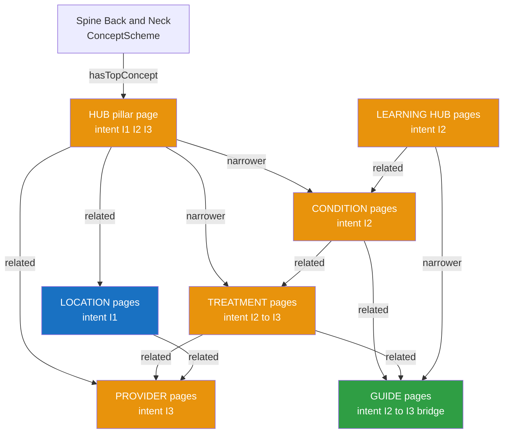
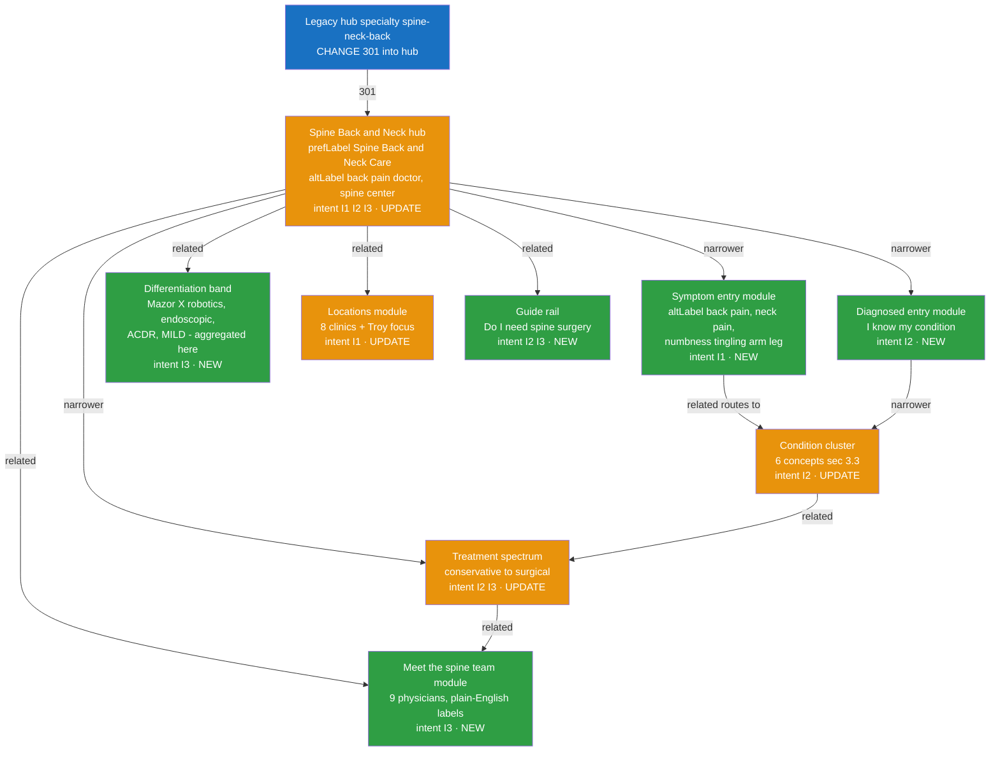
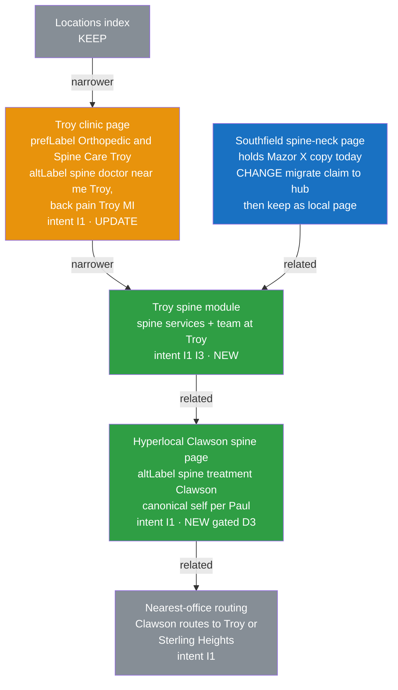
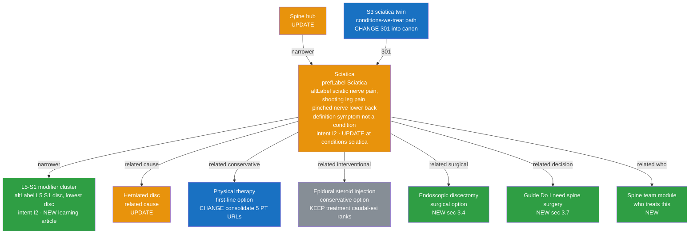
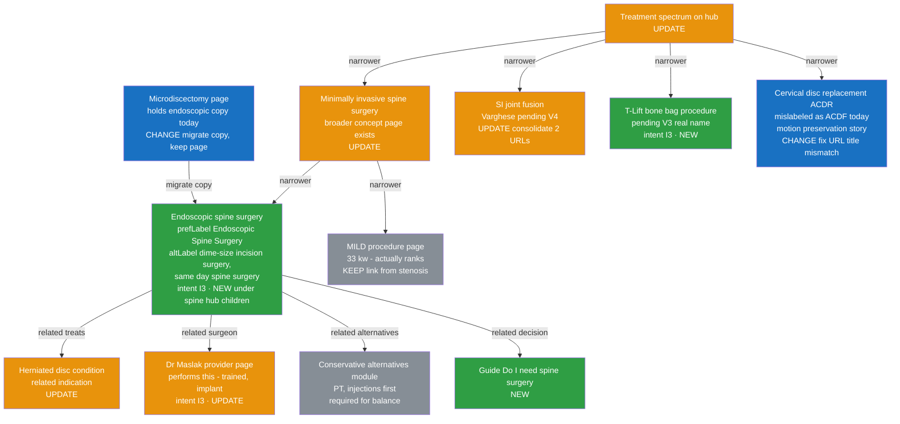
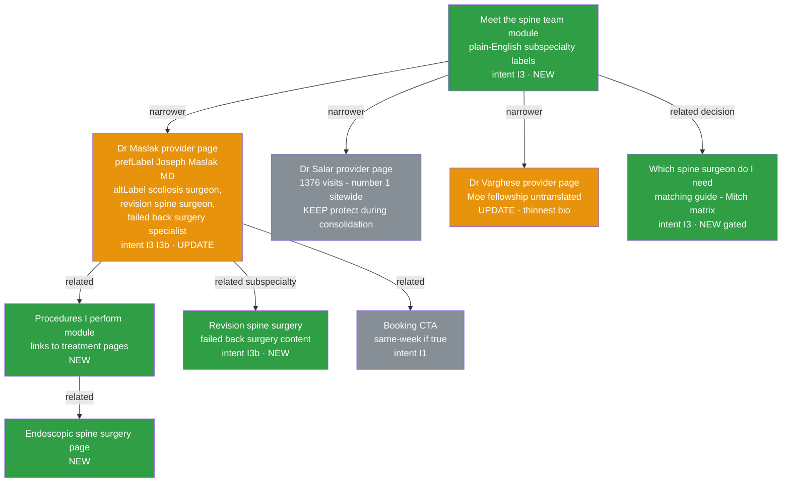
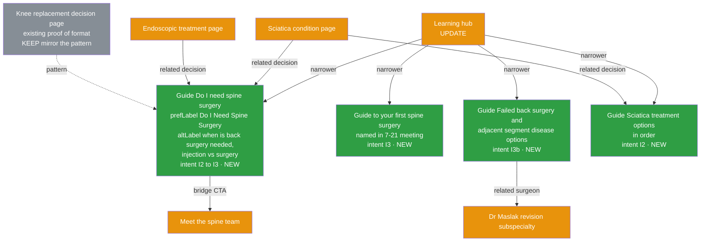

# Spine Semantic Model (SKOS) — Page Types, Diagrams, and the Change Plan

**Owner:** Joe · **Clinical labels:** Mitch sign-off · **Data gates:** per
`routing-clinical-intelligence-process.md` §3–4 · **Templates:** `spine-page-templates.md`
**Status: DRAFT — pending clinical (Mitch) + compliance review**
**Grounded in:** the 7/21 live-index site map (six parallel spine structures; evidence =
Google index + Semrush — canonicals/redirects **unverified**, live check V6 required before any
301), the 7/21 meetings, and the June 2026 Cardinal audit.

> **What this is:** the website's spine knowledge model expressed as SKOS concepts, where every
> concept is a page (or page module), and every node carries contextual labels that make the
> model double as the work plan. Joe's frame from the Paul meeting is the requirement: condition
> × treatment × surgeon × location is a **many-to-many** system — "we have to be smart about how
> we do that" — and spine grows **via internal linking and the learning hub, without
> restructuring ortho** ("orthopedics is the phylum; spine is a subspecialty of it").

---

## 1. Model overview — how SKOS maps to pages

| SKOS element | Meaning here | Example |
|---|---|---|
| `ConceptScheme` | The Spine Care domain on synergyhealth.org | Spine, Back & Neck |
| `Concept` | One page (or a module on a page) | Sciatica condition page |
| `prefLabel` | The clinical term (Mitch-validated) — usually the H1 | "Sciatica" |
| `altLabel` | **Patient language** — the consumer-word map; drives SEO targeting, internal link anchors, call-center vocabulary, and the triage tree (the routing layer) | "shooting leg pain," "sciatic nerve pain," "pinched nerve in lower back" |
| `broader` / `narrower` | Hierarchy (hub → condition → modifier cluster) | Sciatica → L5-S1 disc herniation cluster |
| `related` | Cross-facet links (condition ↔ treatment ↔ surgeon ↔ location ↔ guide) — rendered as on-page internal-link modules | Sciatica ↔ Epidural steroid injection ↔ Endoscopic discectomy |
| `definition` | The page's job in one sentence | "Explain what sciatica is and route to the right next step" |

**Custom contextual annotations on every node:**

- **intent:** `I1` solve my problem · `I2` learn what's causing it · `I3` choose my surgeon ·
  `I3b` returning/revision patient (failed back surgery, adjacent segment disease)
- **status:** `NEW` (create) · `UPDATE` (exists, rework content) · `CHANGE` (consolidate /
  301 / re-canonicalize — pending V6 live check) · `KEEP` (protect; don't touch)
- **inputs:** who feeds it (Mitch, Joel Carr data, physician interview, Katie/Kelly language…)

**Diagram legend (all diagrams below):** green = NEW · amber = UPDATE · blue = CHANGE
(consolidation/redirect) · gray = KEEP.

### Master scheme — the seven page types

Reading it as a patient journey: **I1** lands on hub/location symptom entries → **I2** deepens
on condition + learning pages → **guides** bridge the decision → **I3** chooses on treatment +
provider pages. The `related` edges are not decoration — each one becomes a visible internal-link
module per `spine-page-templates.md`.

---

## 2. Where spine lives today (the consolidation baseline)

The July index shows **six parallel spine structures** (S1–S6) with no effective canonicals:
the hub exists twice, stenosis three times, microdiscectomy three times, and the five
foundational condition pages each rank for ≤1 keyword (sciatica: zero). Meanwhile the real
differentiators — **first-in-Michigan outpatient Mazor X robotics, endoscopic discectomy, ACDR
motion preservation, MILD, iFuse, 3-T MRI** — sit stranded on location pages, bios, and
mislabeled URLs. Full inventory: scratchpad site map; decisions here, execution by Paul after V6.

**Canonical set (the target):**

> **⚠️ HUB DIRECTION IS OPEN — V6 decides.** The July index crawl suggested
> `/specialties/spine-back-and-neck/` as the primary hub (it parents the procedure children).
> But the **GA4 post-migration export (May 21–Jul 21, "SHP - New Site")** shows converting
> sessions landing almost exclusively on the **`/specialty/` structure (1,445 sessions,
> incl. `/specialty/spine-neck-back` 322) vs. 1 session on `/specialties/*`** — i.e., the live
> new site operates on `/specialty/…`, and the `/specialties/…` URLs may be pre-migration
> leftovers that Google still indexes. **Consolidate to ONE hub either way; which URL absorbs
> which is Paul's V6 live-check call** (canonicals, redirects, which template is actually
> served). Do not execute any 301 until V6 answers this.

| Facet | Canonical home | Consolidates (301 after V6) |
|---|---|---|
| Hub | **ONE of** `/specialty/spine-neck-back/` (GA4 evidence: the live receiving page) **or** `/specialties/spine-back-and-neck/` (index evidence: parents the procedure children) — **V6 decides** | the losing twin + parameter/slash variants |
| Conditions | `/conditions/{condition}` (the proven ranker — ganglion-cyst 261 kw) | all `/conditions-we-treat/spine-neck-back-conditions/*` twins; `/conditions/lumbar-stenosis/` → `/conditions/spinal-stenosis/`; root orphans (`/herniated-disc-microdiscectomy/`, `/degenerative-disc-disease-treatment/`) — **migrate their good copy first** (McKenzie, endoscopic, 3-T MRI) |
| Surgical procedures | `/specialties/spine-back-and-neck/{procedure}` (keeps the hub's cluster) | `/treatment/` surgical twins (laminectomy, microdiscectomy, fusion, SI fusion) |
| Injections / interventional | `/treatment/{injection}` (caudal-esi already ranks) | `/specialties/pain-management/` twins |
| Providers | `/providers/{name}` | typo/duplicate profiles; `/our-providers/` directory |

---

## 3. The seven page types — SKOS diagram + change list each

### 3.1 HUB (pillar) page — "Spine, Back & Neck Care"

**Job:** the front door for all three intents; orients by **symptom or diagnosis** (the site is
currently built only for the already-diagnosed — zero symptom-named URLs sitewide); routes
everything; carries the differentiation story that exists nowhere today.
**URL:** the winning hub URL per the §2 V6 decision (GA4 evidence favors
`/specialty/spine-neck-back/`; the diagram uses the hub as a concept, not a fixed URL) —
**UPDATE** (rebuild in place on whichever URL V6 confirms as live).

**Change list:** rebuild hub on the pillar template (dual entry paths; care-team packaging —
"they're not just seeing a surgeon, they're seeing our program") · 301 the S2 twin ·
aggregate the stranded differentiators (inputs: Mitch + V2 substantiation) · remove the
misfiled Munk doctor-location hybrid child (fold into his provider + Port Huron location pages).

### 3.2 LOCATION page — spine × geography

**Job:** capture "near me" and city-name demand (I1); each clinic owns its county — market
location-by-location. **Troy is the Oakland County unlock** (~4,800 obtainable ortho/spine
patients per year going to competitors).

**Change list:** spine module on each clinic page (Troy first) · hyperlocal city pages **only
for cities clearing the D3 first-party count gate** ("cities four and five on that list"),
canonical self-referential (Paul), user-routed to the nearest office · migrate the Mazor X
claim from Southfield's page to the hub (leave a local mention) · Paul's IP/geo-clustering
tool as a future prioritization input · **Troy altLabels include "Rochester Rd," "Rochester
Hills," "Rochester MI" — there is no Rochester clinic; the Troy clinic is on Rochester Road
(Joe, 7/21), so Rochester-area searches and hyperlocal candidates route to Troy.**

### 3.3 CONDITION page — example: Sciatica

**Job:** the I2 workhorse — explain the condition in patient language, then route to the right
next step. Six spine condition concepts: **spinal stenosis · herniated disc · sciatica ·
degenerative disc disease · spondylolisthesis · radiculopathy/pinched nerve**. The five
Cardinal hubs now *exist* but are strangled by duplication (stenosis ×3 URLs; sciatica ranks
for zero). Priority weighting waits on **V1** (the unverified "98% of spine surgeries come from
3–4 terms" claim — Joel Carr).

**Change list (per condition):** consolidate to the `/conditions/` canon (301 map §2, after V6)
· keep the new pages' Grade 6–9 patient copy (it's genuinely good) but add the **E-E-A-T
apparatus** (named physician reviewer, date, citations — zero "medically reviewed" markers
exist on spine pages today) · add the symptom-language opening ("what you might be feeling")
· add the treatment-spectrum and guide modules · **NEW: a patient-language "pinched nerve"
entry** (today only clinical "cervical-radiculopathy" exists — symptom-searchers can't find it)
· red-flag escalation block on every condition page (the stenosis page's bladder/bowel warning
is the pattern to standardize).

### 3.4 TREATMENT page — example: Endoscopic Spine Surgery

**Job:** the I2→I3 bridge — explain the procedure honestly (candidacy, alternatives, recovery),
then differentiate the surgeon. The 7/21 tryout assignments: **Maslak = endoscopic · Varghese =
SI fusion (V4: reconcile with Munk/iFuse legacy content) · McCarty = T-Lift/"bone bag" (V3:
confirm real name)**. Kyphoplasty was explicitly rejected as undifferentiated — keep its page,
don't feature it. Model: Bullard/Hip Insight and Bohm/Sonex.

**Change list:** three NEW/rebuilt differentiation pages (endoscopic, SI fusion, T-Lift) each
from a **1-hour physician interview** ("let him tell you about it… build the website around it")
· fix the ACDR mislabel (patients researching fusion *alternatives* can't find our
motion-preservation story) · every treatment page carries candidacy criteria (Mitch/CCM Plus
Phase 2 output), conservative-alternatives module, honest recovery expectations, and a gated
outcomes slot (CODE surveys only) · procedure-comparison content (fusion vs. ACDR; open vs. MI
vs. endoscopic) — unique in the local market.

### 3.5 PROVIDER page — example: Dr. Maslak

**Job:** the I3 decision surface. The bios already carry real subspecialty differentiation *in
prose* — Maslak: Cleveland Clinic complex-spine fellowship, **deformity/revision (adult
scoliosis, pseudoarthrosis, adjacent segment disease, hardware failure)**; Salar: motion
preservation/arthroplasty (his bio = **#1 page sitewide, 1,376 visits — protect it**); Munk:
SI/iFuse national trainer; McCarty: complex spine + first-in-MI outpatient Mazor X; Lee:
endoscopic/fusion-avoidance; Varghese: elite Twin Cities/John H. Moe deformity fellowship,
**never translated for patients** (thinnest bio). But nothing assembles a *choosing* journey —
no team page, no surgeon↔procedure matching.

**Change list:** "Meet the spine team" module on the hub with plain-English labels + a
**surgeon↔procedure matching matrix** (Mitch-approved; gated per process §4) · "procedures I
perform" module on each bio linking treatment pages (the skos:related made visible) · translate
fellowship prestige into patient language ("everybody does a fellowship, but patients don't
know that") · resolve V5 (medical-director attribution, Zamorano page, Munk/Yacisen locations)
· dedupe provider URLs and retire `/our-providers/` · substantiate-or-remove bio stats (V2).

### 3.6 LEARNING HUB page — the education layer

**Job:** answer the long tail of I2 questions; feed AEO/AIO/GEO citations; host the guides.
Meeting verdict: current learning-hub content is "really dated — all of our old information,"
and commodity articles are worthless now ("everyone can spin up an article") — the value is
**physician-authored relevance** ("because it's authored by them, it has more relevance") and
answering the questions patients actually ask (second opinions, MRI reads, "do I need X").

**Change list:** refresh/retire dated stock (audit + purge list: the Mendelson-era posts —
redirect, don't delete; the chronic-pain legacy post still pulls 162 visits) · every new
article ships physician-authored/reviewed with visible E-E-A-T block · articles cluster under
their parent condition ("a lot of cluster pages that have the parent page of Sciatica") ·
question-formatted sections for answer engines.

### 3.7 GUIDE page — **where it lives and what it contains** (the direct answer)

**Where guide pages live:** guides are **decision-support assets that live in the learning hub's
namespace — one clean, canonical home at `/guides/{topic}/` — and are cross-linked as the
I2→I3 bridge from every condition, treatment, and hub page they serve.** They are narrower
concepts of the learning hub in the hierarchy, but their *power* is the `related` edges: a
guide is reached mostly from condition/treatment pages, not from browsing. One URL per guide,
no duplicates — the existing knee decision page
(`/how-do-i-know-if-i-need-knee-replacement-surgery/`, a root post that ranks) is the internal
proof the format works; spine guides get the structured home from the start, and the knee page
is the pattern for what to mirror.

**When a guide (vs. a condition/treatment page or article):** build a guide when the patient's
question is a **decision or a journey**, not a definition — "do I need…", "which…", "what
happens when…", "X vs. Y", "in what order." Needed-topic guides come from the intent gaps the
crawl confirmed (zero decision-support content in spine); opportunity-topic guides come from
GSC question queries + call-center questions (D2/D5) that clear the process §4 gates.

**What a guide contains** (full template in `spine-page-templates.md` §3.7):

1. The decision framework up front (who this guide is for; the honest short answer).
2. Symptom → pathway mapping in patient language (the altLabel layer at work).
3. The stepped pathway: conservative → interventional → surgical, with honest indications
   for each step (Mitch-approved; mirrors the conservative-first front door).
4. Candidacy criteria — clinically reviewed (CCM Plus Phase 2 output when live).
5. What-to-expect timeline (visit, imaging, decision, recovery).
6. Insurance/coverage clarity (D7 — plans vary by provider; no flat statements).
7. Named physician author + reviewer + credentials + review date (E-E-A-T block).
8. FAQ block with schema (AEO/AIO fodder).
9. Dual CTA: soft I2 primary ("get your specific answer — see a spine specialist") +
   I3 bridge secondary ("meet the spine team" / "request a second opinion").

**First guides to build (all NEW):**

| Guide | Intent | Initiative it serves | Key inputs |
|---|---|---|---|
| Do I need spine surgery? | I2→I3 | Decision layer (crawl fix #8) | Mitch + McCarty; knee-page pattern |
| Guide to your first spine surgery | I3 | Decision layer; named in the 7/21 meeting | Anna (what booking surgery looks like post-Sept 1), Mitch |
| Failed back surgery & adjacent segment disease: your revision options | **I3b** | Returning-patient cohort (absent from site; Paul-meeting insight) | Maslak (revision/deformity subspecialty), Mitch |
| Sciatica treatment: your options in order | I2 | Condition rescue | Oddo/pain (conservative first), Mitch |
| Injection vs. surgery: how we decide | I2→I3 | Decision layer + interventional front door | Oddo/Lee, Mitch |
| Which spine surgeon do I need? | I3 | Surgeon matching (gated on Mitch matrix, V5) | Mitch, Katie |

---

## 4. Routing intelligence in the model

The **altLabel layer is the routing layer.** One shared consumer-language ↔ clinical-term ↔
destination map (maintained per process §6, validated by Mitch, starting from the Friday triage
buzzword list — "as simple as radiculopathy… there's two or three") drives four surfaces:

1. **Site internal routing:** symptom-entry modules route patient words to condition pages;
   condition pages route to the treatment spectrum; treatments route to the differentiated
   surgeon. The **conservative-first front door** (PT / interventional pain: Oddo, Lee, Kassa,
   Singh) is mirrored in `related` edges so I1 patients land on the right first step and stay
   in-system until they're surgical candidates.
2. **Call center:** Kelly's scripts use the same words and the same destinations
   (`pm/spine-intake-qualification-script.md`).
3. **Steve's triage decision tree** (Santosh + Joe rollout): its branches and the site's
   symptom-entry logic must agree; three-steps-max applies to the web UX too.
4. **PL leave-behinds** (Kristen): referrer-facing versions of the same differentiation.

**Red-flag rule everywhere:** any symptom-entry surface carries the escalation block
(bladder/bowel changes, fever with back pain, trauma → urgent care/911 messaging — pattern
already exists on the stenosis page; standardize it, clinically signed off).

---

## 5. Initiative → change plan (additions, changes, updates, new content per initiative)

| Initiative | Concepts touched | Status | Employee inputs | Agent work | Gate |
|---|---|---|---|---|---|
| **1. Hub rebuild + consolidation** | Hub; S2 twin; misfiled Munk child | UPDATE + CHANGE | Paul V6; Mitch review; Cardinal coordination | seo-specialist 301 map; content-creator hub copy | V6 → Mitch → compliance |
| **2. Endoscopic differentiation (Maslak)** | Endoscopic page; microdiscectomy copy migration; Maslak bio; herniated-disc links | NEW + CHANGE + UPDATE | Maslak hour; Mitch comments | content-creator draft; aeo FAQ block | Mitch → compliance |
| **3. SI fusion (Varghese)** | SI-fusion consolidation ×2→1; Varghese bio | UPDATE + CHANGE | **V4 first** (Varghese vs. Munk/iFuse); Varghese interview | content-creator; seo-specialist | V4 → Mitch |
| **4. T-Lift (McCarty)** | T-Lift page | NEW | **V3 first** (real procedure name); McCarty via Mitch | content-creator | V3 → Mitch → compliance |
| **5. Condition rescue (6 conditions)** | 6 condition canons; S3 twins; stenosis ×3→1; pinched-nerve entry | UPDATE + CHANGE + NEW | V1 priority data (Joel Carr); Mitch review; E-E-A-T reviewers assigned | content-creator E-E-A-T + symptom openings; seo-specialist consolidation | V6 → V1 → Mitch |
| **6. Symptom-entry triage layer** | Hub symptom module; condition "what you might be feeling" blocks; red-flag blocks | NEW | Friday triage list (Katie/Mitch/Kelly); Steve's tree branches | content-creator + call-center-manager shared vocabulary | Mitch (clinical safety) |
| **7. Decision/guide layer** | 6 guides (§3.7); knee-page pattern | NEW | Mitch; physicians per guide; Anna (surgery journey) | content-creator; aeo-specialist | Mitch → compliance |
| **8. Meet-the-team + surgeon matching** | Team module; matching guide; bio "procedures" modules; V5 fixes; provider dedupe | NEW + UPDATE + CHANGE | **V5 first**; Mitch matrix | content-creator; seo-specialist dedupe map | V5 → Mitch → Katie (routing ops) |
| **9. Hyperlocal expansion** | City pages (Clawson pattern) | NEW (gated) | **D3 city counts** (Joel Carr); Paul canonical rule | seo-specialist + content-creator | D3 threshold |
| **10. Learning-hub refresh** | Dated stock; physician-author pipeline; FAQ schema | UPDATE + NEW | Physician authors; Mayo offered to write (ortho) | content-creator pipeline; aio/geo formatting | Clinical review per piece |
| **11. Rebrand/staleness purge** | Legacy Mendelson posts (redirect — one pulls 162 visits); Kornblum testimonial; stale Munk copy | CHANGE | Paul execution | seo-specialist redirect list | Joe |

---

## 6. Governance

- **This file is the model of record.** Clinical label changes (prefLabel, candidacy language,
  matching) → **Mitch sign-off**. New concepts → Joe + the process §4 data gates. Status/URL
  changes → seo-specialist consolidation plan → **V6 live check** → Paul executes → Cardinal
  informed.
- Statuses update as work ships (NEW → KEEP; CHANGE → retired). Review the model at the 4-week
  OODA alongside the scorecard.
- **Sports medicine (Phase 2, deferred):** the crawl found **no sports hub at all** (a thin
  taxonomy page; sports filed in nav as a location type; ACL/meniscus/concussion condition
  pages missing entirely; the bench's real differentiation — BEAR, revision ACL,
  Return-to-Sport testing, pro-team credentials — stranded on bios). When Phase 2 opens:
  create `/specialties/sports-medicine/` as a peer pillar, reuse this model's page types and
  templates wholesale, and reconcile with the 7/21 sports-division concept (care-team
  packaging: Mayo + Varghese sports-spine + Heil + chiro + PT). Mitch supplies the clinical
  terms, per the meeting.
